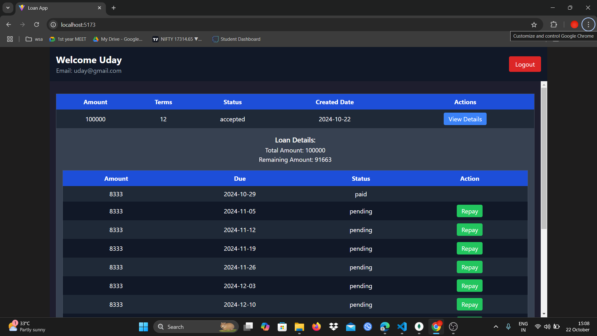
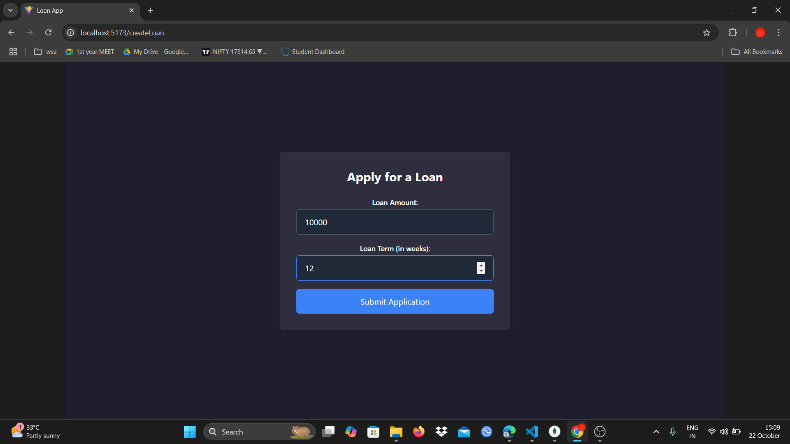
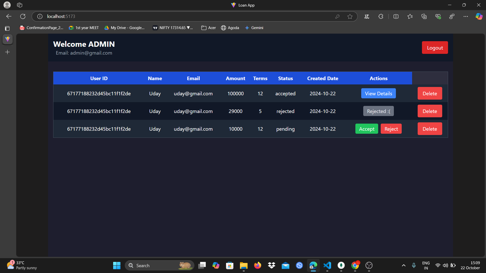
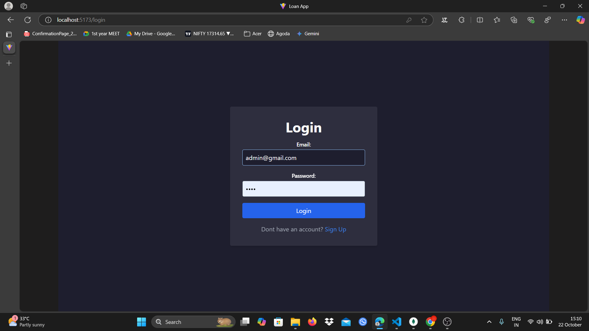
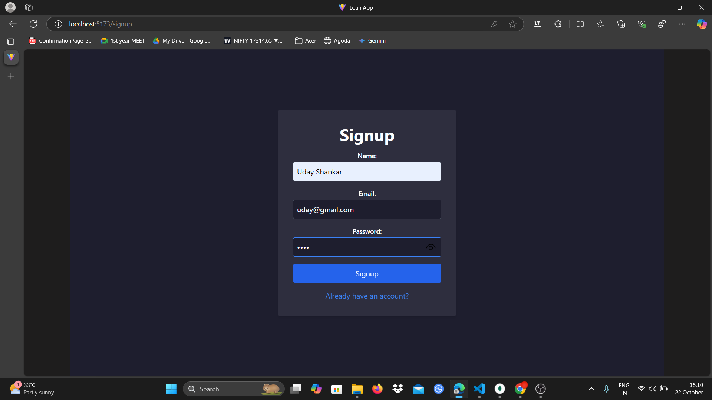

# Loan App

Welcome to the **Loan App**! This application provides a platform for managing loans for both administrators and clients.

## Features

- **User Registration and Loan Requests**
- **Loan Approval Process**
- **Repayment Management**
- **Additional Loan Requests**

## Cloning the Project from GitHub

To clone the Mini Loan App project from GitHub, follow these steps:

1. Open your terminal or command prompt.
2. Navigate to the directory where you'd like to clone the project.
3. Use the following command to clone the repository:

   ```bash
   git clone https://github.com/UdayShankar3953/Loan-app.git
   cd Loan-app
   ```

## Running the Application Locally

To run the application locally, follow these steps:

### Client Setup (Using npm)

1. Navigate to the client directory:

   ```bash
   cd client
   ```

2. Install the dependencies:

   ```bash
   npm install
   ```

3. Start the client:

   ```bash
   npm run dev
   ```

### Server Setup

1. Navigate to the server directory:

   ```bash
   cd ../server
   ```

2. Install the dependencies:

   ```bash
   npm install
   ```

3. Start the server:

   ```bash
   npm run dev
   ```

Make sure the server runs on **Port 5000** and the client on **Port 5173**.

## Admin Credentials

To access the admin features, log in using the following credentials:

- **Email:** admin@gmail.com
- **Password:** admin1234

## Upgrading a User to Administrator

To upgrade a user to an administrator, follow these steps:

1. Log in with the admin credentials.
2. Navigate to the User Management section.
3. Select the user you'd like to upgrade.
4. Modify the user's profile in the MongoDB database:
   - Change the `user_type` field from `"user"` to `"admin"`.

The user will now have administrative privileges and can access admin features.

## Demo Video

Watch the demo of the Loan App here: [Demo Video](https://drive.google.com/file/d/1U10XerRbYlUgOZJ0vmegWXcIRvFU0jj0/view?usp=sharing)


## Screenshots

### User Dashboard


### Loan Request


### Admin Dashboard


### login page


### Sign up page


